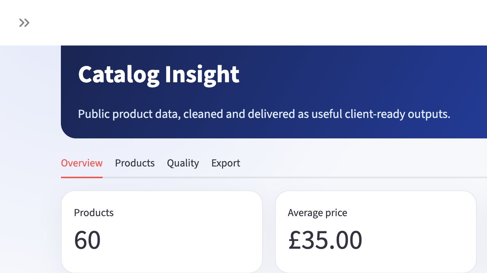
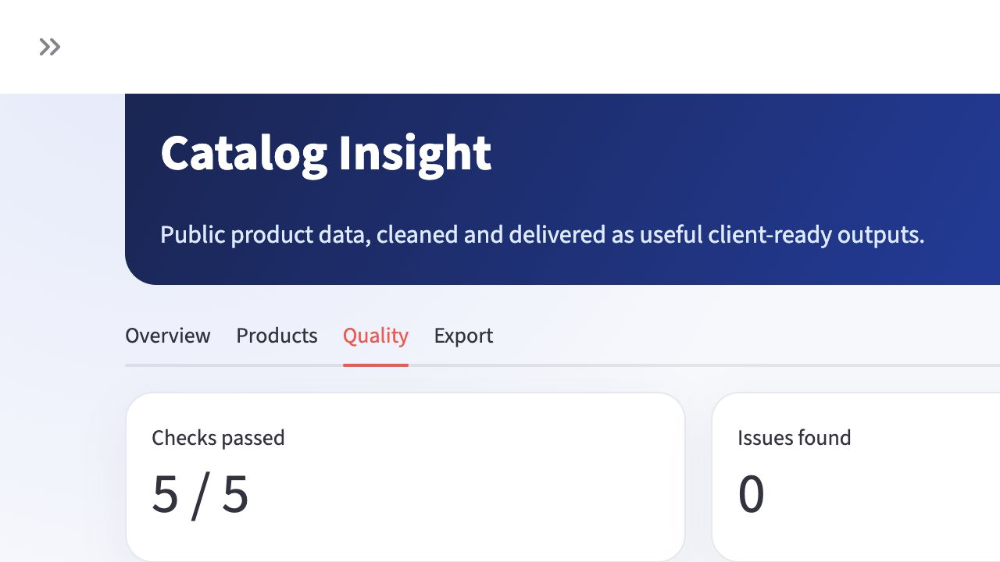

# Catalog Insight

Catalog Insight is a small end-to-end product-data project built for a realistic
freelance delivery: collect public catalog records, clean them, store them in a
repeatable format, and hand the client a useful Excel report instead of a raw
HTML dump.

The demo uses [Books to Scrape](https://books.toscrape.com/), a website created
specifically for scraping practice. It does not bypass authentication,
CAPTCHAs, or access controls.

## What it delivers

- Scrapy spider with pagination and product-detail requests
- title, category, rating, price, tax, stock, description, URL, and image fields
- normalization, validation, duplicate detection, and SQLite upserts
- JSONL output for machine-readable delivery
- formatted Excel workbook with product, summary, category, and quality sheets
- spreadsheet formula-injection protection for externally collected text
- Streamlit dashboard with overview, product explorer, delivery checks, and downloads
- pytest coverage, Ruff linting, and GitHub Actions
- conservative request rate, retries, AutoThrottle, and `robots.txt` support

## Project flow

```text
Catalog pages
    → product detail pages
    → normalize and validate
    → deduplicate
    → SQLite + JSONL
    → formatted Excel report
    → interactive dashboard
```

## Preview

### Dashboard overview



### Automated delivery checks



## Quick start

```bash
python3 -m venv .venv
source .venv/bin/activate
python -m pip install -e ".[dev]"
python run_pipeline.py --max-pages 3
streamlit run dashboard/app.py
```

Generated files are placed in `data/`:

- `books.sqlite`
- `books.jsonl`
- `books_report.xlsx`

A small practice-site sample is included in `data/sample/`, so the dashboard is
useful immediately after installation. Running the pipeline creates a fresh
delivery in `data/`, which then becomes the dashboard's default source.

Run checks with:

```bash
ruff check .
pytest
```

## Example client use

The same workflow can be adapted to a permitted public catalog when a client
needs:

- comparable product and price data
- a clean Excel/CSV delivery
- repeatable updates rather than one-off copy and paste
- validation and duplicate handling
- a lightweight dashboard for filtering the collected records

The target site's terms, `robots.txt`, rate limits, and data-use restrictions
must be reviewed before adapting the spider.

## Data quality

The dashboard includes automated delivery checks for required fields, duplicate
product IDs and URLs, non-negative prices, and ratings within the expected
range. The same checks can be extended with client-specific rules before a
scheduled or recurring delivery.

## Scope boundaries

This repository demonstrates the data workflow, not a promise that every
website can or should be scraped. It does not contain anti-bot bypasses,
credential collection, proxy rotation, or private account automation.

## Attribution

The project was designed after studying the small MIT-licensed
[`scrapy/quotesbot`](https://github.com/scrapy/quotesbot) teaching repository.
Catalog Insight is a substantial independent rebuild with a different domain
model, storage and reporting layer, dashboard, tests, and CI. The original
license notice is preserved in [THIRD_PARTY_NOTICES.md](THIRD_PARTY_NOTICES.md).

## License

MIT
